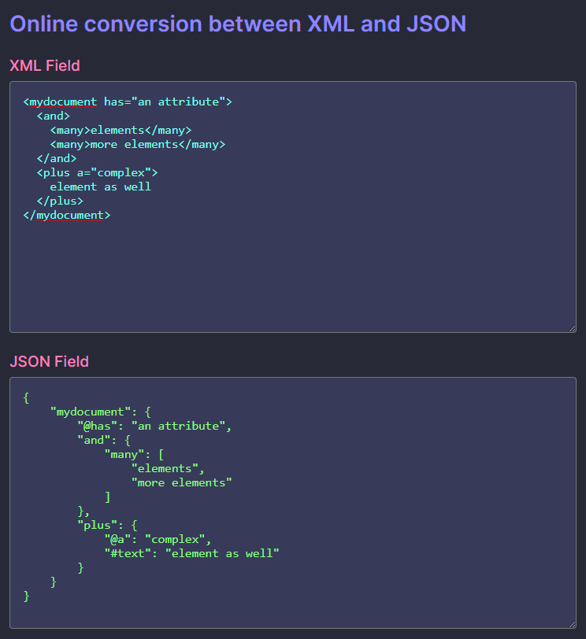

# demo-python-project-backstage

Brief description of the project.

## Setup

Install the Okteto CLI, and setup an AKS cluster. Follow the connection instructions to add the AKS cluster connection info to your `.kube/config`.

```bash
git clone https://github.com/lucasmelin/demo-python-project-backstage.git
okteto up
```

This will start the container running on AKS.

## Screenshots

